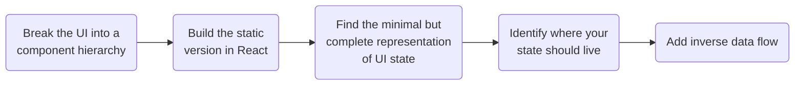

# Thinking in React : Searchable data table

This is a searchable data product table. It contains a search bar and a checkbox filter for the items that are in the table. [Click here to view the site.](https://searchable-product-data-table.netlify.app/)

## Notes

1.  **Break the UI into a component hierarchy**
    a. draw boxes around every component and subcomponent using the <i>single responsibility principle</i>
    b. name the components and subcomponents
    c. arrange them into a hierarchy, e.g.

        - Grandparent
        	- Parent
        	- Parent
        		- Child
        		- Child

2.  **Build a static version in React**
    a. build a UI that renders your data model without adding any interactivity
    b. you can build from the bottom up
    c. use props to pass data from a parent to a child
    d. don't use state; it is reserved for interactivity

3.  **Find the minimal but complete represantation of UI state**
    a. you need to let users change your underlying data model using state
    b. keep it DRY (Don't repeat yourself)
    c. Think of all the pieces of data in your application, e.g. - the original list of fruits and vegetables - the search text the user has entered - the value of the checkbox - the filtered list of fruits and vegetables
    d. which of them is state?
      
     The following define what state isn't:
      
     - data that REMAINS UNCHANGED over time - data that is PASSED FROM A PARENT via PROPS - data that is COMPUTED on EXISTING props or state in your component
      
    e. the original list _remains unchanged_ over time and it's _passed from the parent as a prop_.
    f. the search text _changes_ over time and it _can't be computed_ from anything.
    g. the value of the checkbox also _changes_ over time and _can't be computed_ from anything.
    h. the filtered list _can be computed_ using the _search text_.
    i. therefore, the search text data and the checkbox data are state

4.  **Identify where your state should live**
    a. react uses one way data flow : passing data from the parent to the child

    - identify every component that renders something based on state
    - find their closest common parent component
    - decide where state should live:
      - their common parent
      - a component above their common parent
      - create a component solely for holding state and place it above their common parent

5.  **Add inverse data flow**
    a. you need to support data flowing in the opposite direction
    b. the children need to update the state in the common parent using the _setFunctions_,

# Implementing a UI in React : Summary

Start with the mockup from the designer

> Break the UI into components, describe visual states and connect them so that data flows through them

